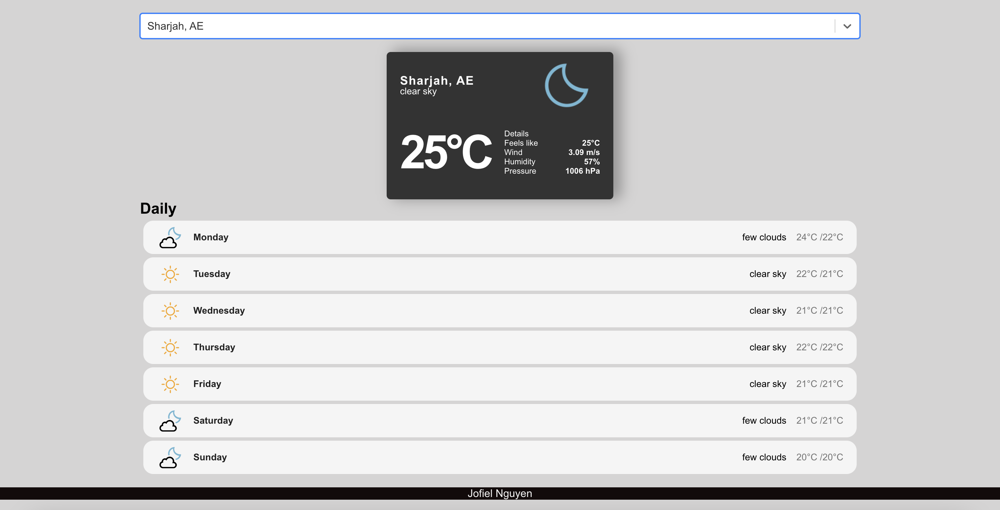

# React-WeatherApp

The React-WeatherApp is a user-friendly web application that provides real-time weather data. Users can easily access detailed weather forecasts based on their location, thanks to its intuitive interface and location-based functionality. The app boasts a sleek design, customizable settings, and responsiveness across devices, ensuring users receive accurate and accessible weather updates.

## Features

- **Real-Time Data:** Fetches up-to-date weather information from reliable sources.
- **Location-Based Forecasts:** Provides detailed weather forecasts based on user's location.
- **Sleek Interface:** Features an intuitive and visually appealing design.
- **Customizable Settings:** Allows users to personalize their weather experience.
- **Responsive Design:** Ensures a seamless experience across various devices.

## Installation

To run the React-WeatherApp locally:

1. Clone this repository.
2. Navigate to the project directory.
3. Run `npm install` to install dependencies.
4. Run `npm start` to start the development server.

## Usage

Simply open the app in your web browser and allow location access to receive weather updates for your current location. Alternatively, you can manually search for weather information by entering a location.

## Contributing

Contributions are welcome! Please fork the repository and submit a pull request with your changes.
## Screenshots

## License

This project is licensed under the [MIT License](LICENSE).
